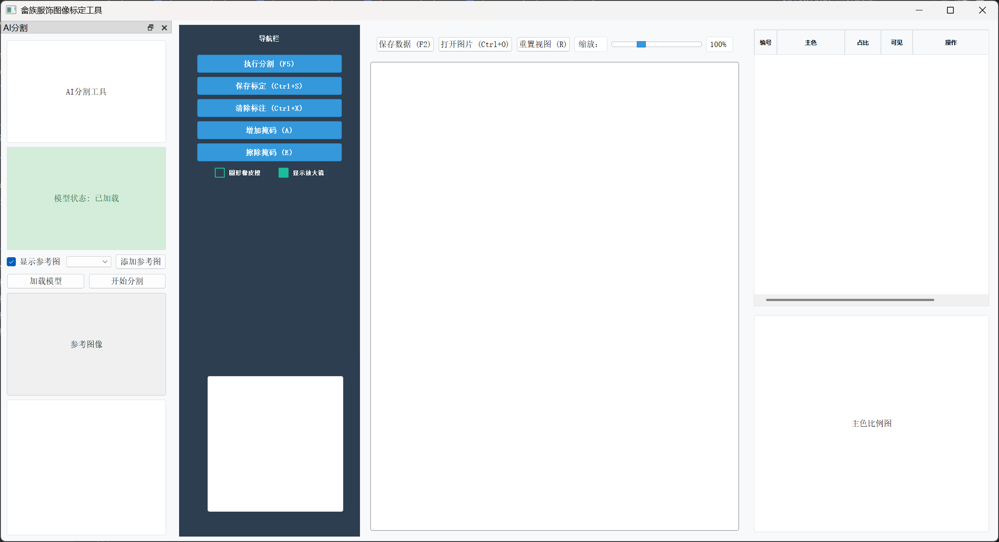
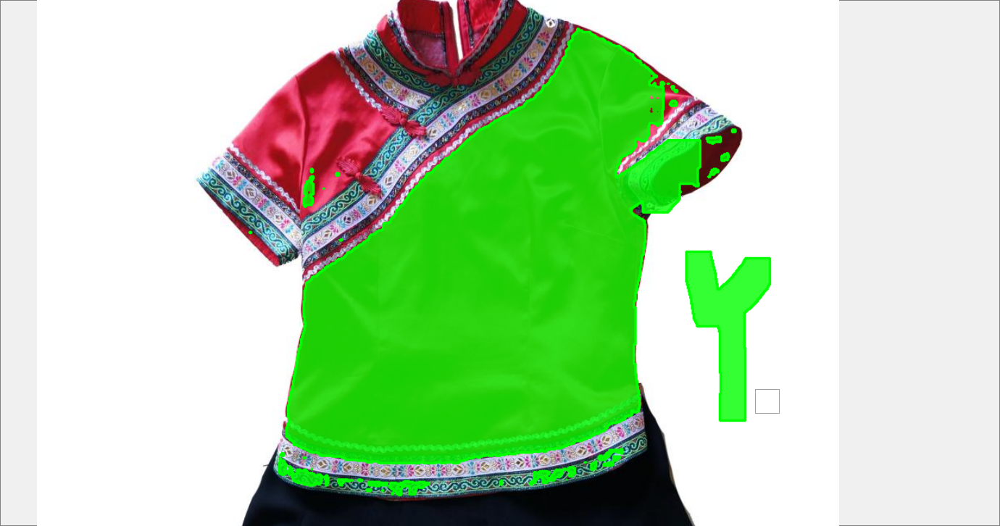
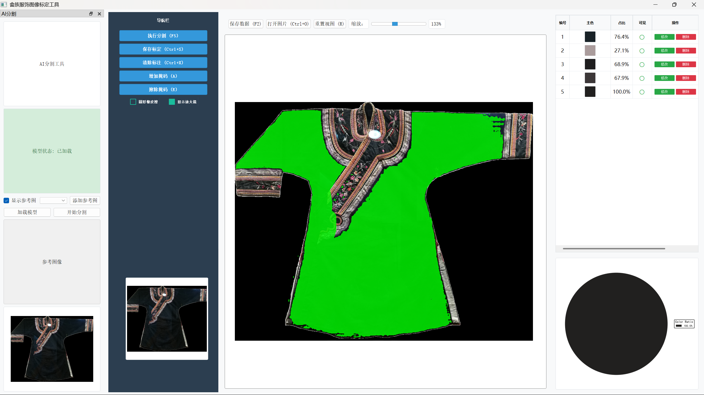
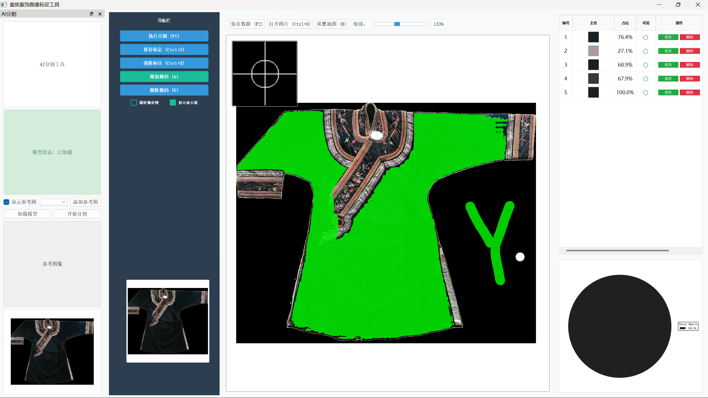
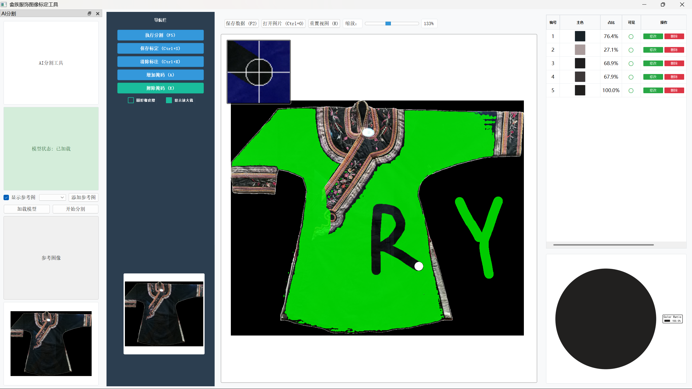
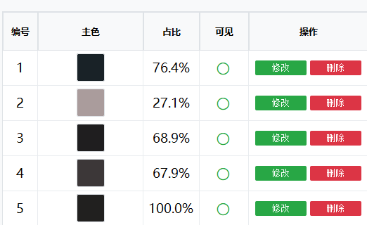
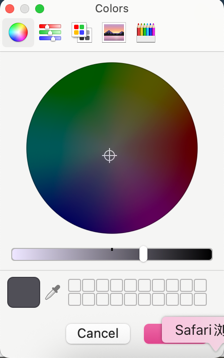
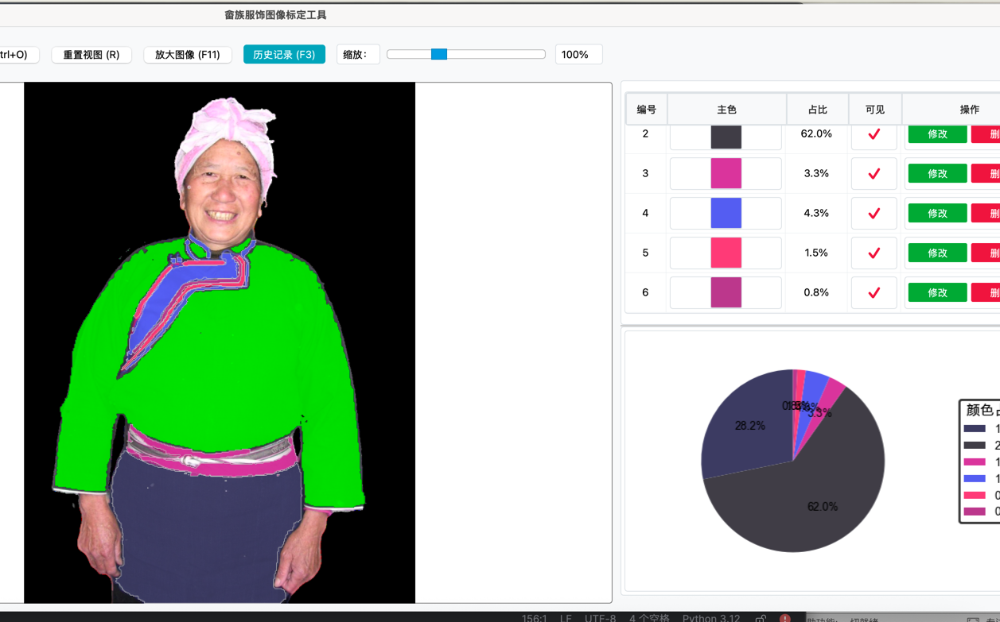

# 畲族服饰图像标定工具 (She Ethnic Costume Annotator)

> 更新时间：2024-06-03

本工具用于对畲族服饰图像进行标定，支持通过点击、分割与掩码绘制方式进行区域主色提取与保存，最终输出 RLE 压缩的 JSON 标注信息，便于后续的图像分析与主色统计工作。

---

## ✨ 功能特性

| 功能             | 描述                                          |
| ---------------- | --------------------------------------------- |
| ✅ 打开图片      | 支持 `.jpg`, `.png`, `.bmp` 等图像格式加载    |
| ✅ 缩放拖动      | 鼠标滚轮缩放、鼠标拖动移动图像                |
| ✅ AI 分割       | 通过添加前景点和背景点触发智能分割            |
| ✅ 手动修改      | 支持手动增加或擦除掩码区域进行精细调整        |
| ✅ 掩码显示切换  | 可通过右侧 ✔/✖ 控制各掩码显示状态             |
| ✅ 主色 RGB 编辑 | 右侧表格可编辑 R/G/B 数值，并实时更新显示颜色 |
| ✅ 撤销与重做    | Ctrl+Z 撤销、Ctrl+Y 重做掩码操作              |
| ✅ 标定保存      | 生成压缩后的 JSON 文件，记录主色与掩码        |
| ✅ 自动加载      | 再次打开图片时会自动加载对应的标定记录        |

---

## 📦 安装依赖

推荐使用 Conda 创建虚拟环境：

```bash
conda create -n shezu python=3.12
conda activate shezu
pip install -r requirements.txt
```

---

## 🚀 启动方式

```bash
python src/color_annotator/main.py
```

---

## 🗂 项目结构

```
project_root/
├── src/
│   └── color_annotator/
│       ├── gui/
│       │   ├── main_window.py
│       │   ├── image_viewer.py
│       │   ├── ai_segmentation.py
│       ├── sam_interface/
│       │   ├── sam_segmentor.py
│       ├── utils/
│       │   ├── sam_thread.py
│       ├── training/              ← 模型训练相关代码
│       ├── advanced_training/     ← 高级训练方法
│       ├── tools/                 ← 工具函数
│       ├── main.py                ← 主程序入口
│       └── setup_models.py        ← 模型初始化配置
├── images/                        ← 原始图像文件目录
├── annotations/                   ← 标定结果（JSON）保存目录
├── checkpoints/                   ← 模型权重文件目录
├── test_images/                   ← 测试图像目录
├── test_results/                  ← 测试结果目录
├── improved_results/              ← 优化后的结果目录
├── read_images/                   ← README使用的示例图片
├── reference_images/              ← 参考图像目录
├── color_segmentation_dataset/    ← 颜色分割数据集
├── requirements.txt               ← 项目依赖
├── LICENSE                        ← 开源许可证
└── README.md                      ← 项目说明文档
```

---

## 🧾 JSON 标定数据格式示例（压缩 RLE）

```json
{
  "masks": {
    "mask_0": {
      "color": [163, 57, 76],
      "visible": true,
      "editable": false,
      "size": [512, 512],
      "rle": [
        [32000, 12],
        [45678, 9]
      ]
    }
  }
}
```

---

## 🧾 使用说明

### 界面


支持手动拖拽、鼠标滚轮缩放图片

### 步骤

#### 手工AI 分割

1、双击左键添加前景点；Ctrl+单击左键添加背景点（前景点为绿色；背景点为红色）


2、支持ctrl+X、ctrl+Y撤销前景背景点

3、点击执行分割


#### 人工微调修改

**增加掩码**

**擦除掩码**

**支持撤销**

Ctrl+Z 撤销；Ctrl+Y 恢复操作

**清除标注**

一键清除绿色掩码

**保存标定**


支持修改、删除、显示、调整 RGB 主色参数


点击主色块弹出颜色调节窗口


**修改**

修改完成后点击保存标定保存修改

**保存标定**

点击保存数据，会将标定数据按照文件名保存为对应的标定 JSON 文件

#### AI 分割
支持一键完成分割标定，对服饰进行色彩分析提取，模型训练ing...

### 模型训练
将对应的json文件，生成对应的掩码图像


提取样本库主色供给模型参考


由于样本太少，目前仅仅围绕小样本和数据增强展开，效果不佳
