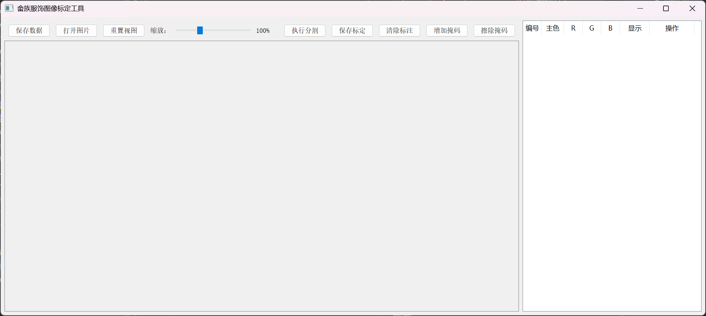
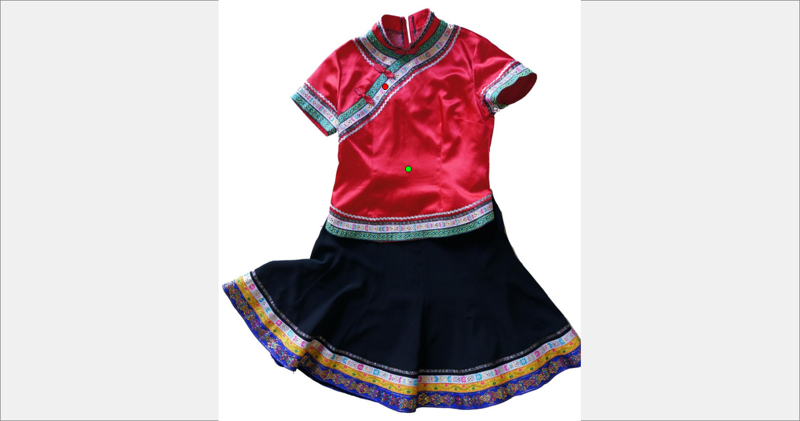
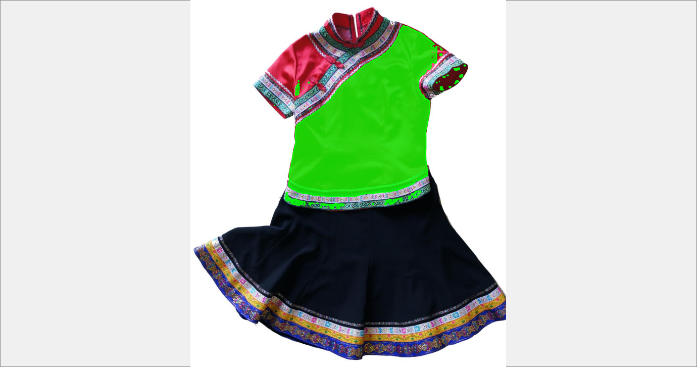
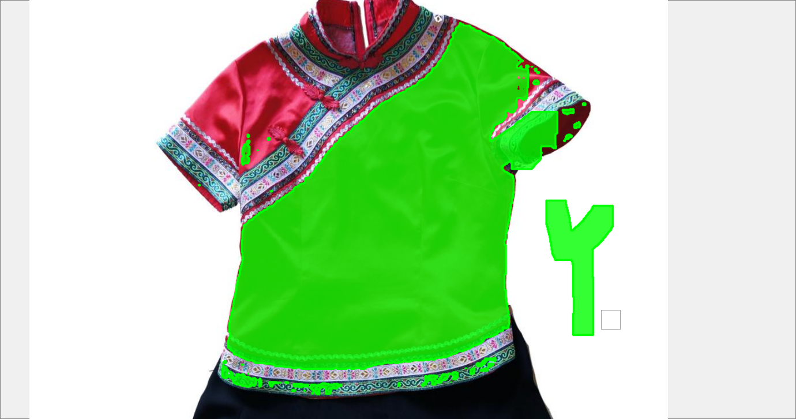
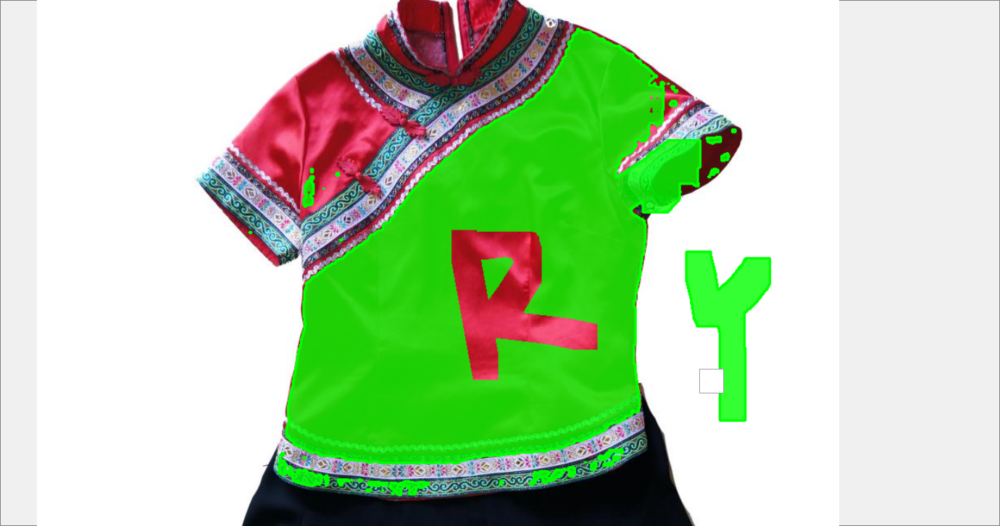
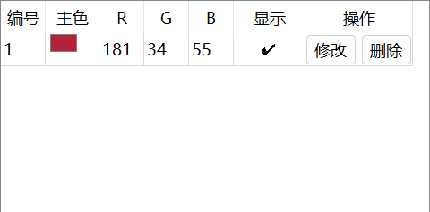
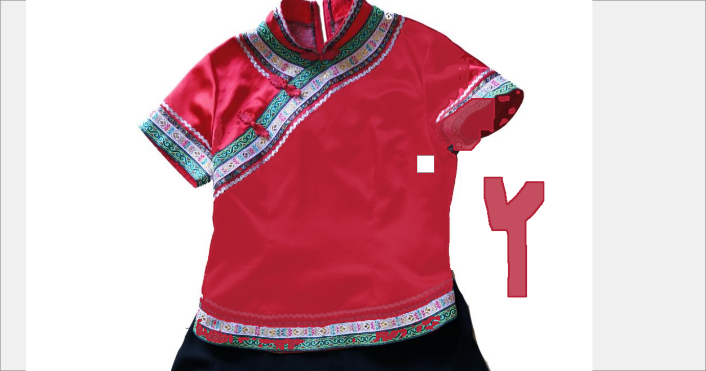

# 畲族服饰图像标定工具 (She Ethnic Costume Annotator)

> 更新时间：2025-05-13

本工具用于对畲族服饰图像进行标定，支持通过点击、分割与掩码绘制方式进行区域主色提取与保存，最终输出 RLE 压缩的 JSON 标注信息，便于后续的图像分析与主色统计工作。

---

## ✨ 功能特性

| 功能            | 描述                                          |
| --------------- | --------------------------------------------- |
| ✅ 打开图片      | 支持 `.jpg`, `.png`, `.bmp` 等图像格式加载    |
| ✅ 缩放拖动      | 鼠标滚轮缩放、鼠标拖动移动图像                |
| ✅ 添加标定      | 支持通过点击触发分割或绘制掩码进行区域标定    |
| ✅ 修改标定      | 点击“修改”按钮后可对区域进行擦除/添加         |
| ✅ 掩码显示切换  | 可通过右侧 ✔/✖ 控制各掩码显示状态             |
| ✅ 主色 RGB 编辑 | 右侧表格可编辑 R/G/B 数值，并实时更新显示颜色 |
| ✅ 撤销与重做    | Ctrl+Z 撤销、Ctrl+Y 重做掩码操作              |
| ✅ 标定保存      | 生成压缩后的 JSON 文件，记录主色与掩码        |
| ✅ 自动加载      | 再次打开图片时会自动加载对应的标定记录        |

---

## 📦 安装依赖

推荐使用 Conda 创建虚拟环境：

```bash
conda create -n shezu python=3.9
conda activate shezu
pip install -r requirements.txt
```

---

## 🚀 启动方式

```bash
python src/color_annotator/main.py
```

---

## 🗂 项目结构

```
project_root/
├── src/
│   └── color_annotator/
│       └── checkpoints/
│       	├── sam_vit_b.pth
│       └── gui/
│       	├── image_viewer.py
│       	├── main_window.py
│       └── sam_interface/
│       	├── sam_segmentor.py
│       └── utils/
│       	├── sam_thread.py
│       ├── images/             ← 原始图像文件目录
│       ├── annotations/        ← 自动保存标定结果（JSON）
│       └── ...
│	├── main.py
├── README.md
└── requirements.txt
```

---

## 🧾 JSON 标定数据格式示例（压缩 RLE）

```json
{
  "masks": {
    "mask_0": {
      "color": [163, 57, 76],
      "visible": true,
      "editable": false,
      "size": [512, 512],
      "rle": [[32000, 12], [45678, 9]]
    }
  }
}
```

---

## 🧾 使用说明

### 界面

支持手动拖拽、鼠标滚轮缩放图片

### 步骤
#### ai 分割
1、双击左键添加前景点；ctrl+单击左键添加背景点（前景点为绿色；背景点为红色）

2、点击执行分割


#### 人工微调修改
**增加掩码**

**擦除掩码**

**支持撤销**

ctrl+z撤销；ctrl+y撤销撤销

**清除标注**

一键清除绿色掩码

**保存标定**


支持修改、删除、显示、调整RGB主色参数

**修改**

修改完成后点击保存标定保存修改

**保存标定**

点击保存数据，会将标定数据按照文件名字映射成对应的标定json文件，暂时没搞文件名相同映射，暂时只是覆盖


