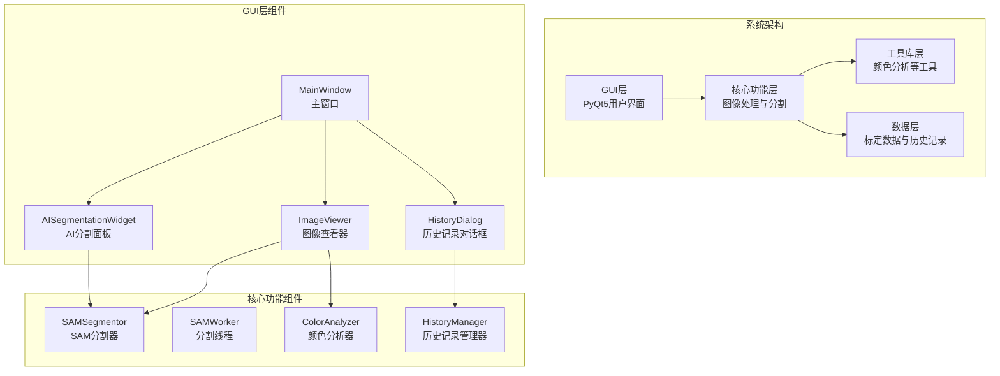
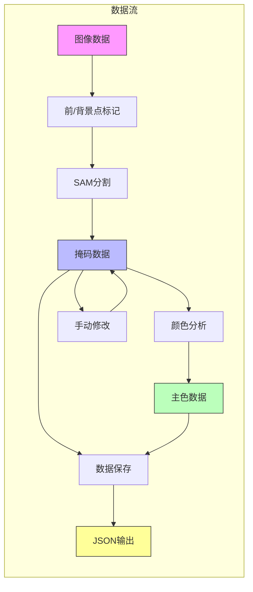
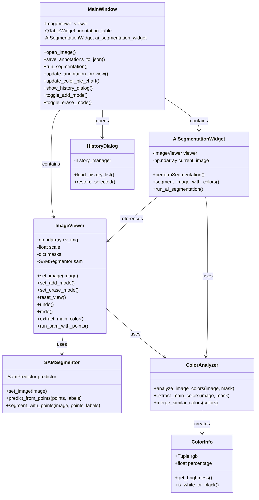
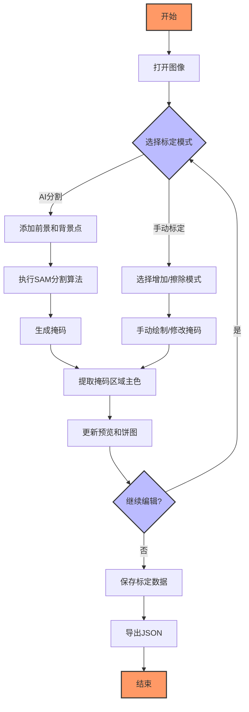
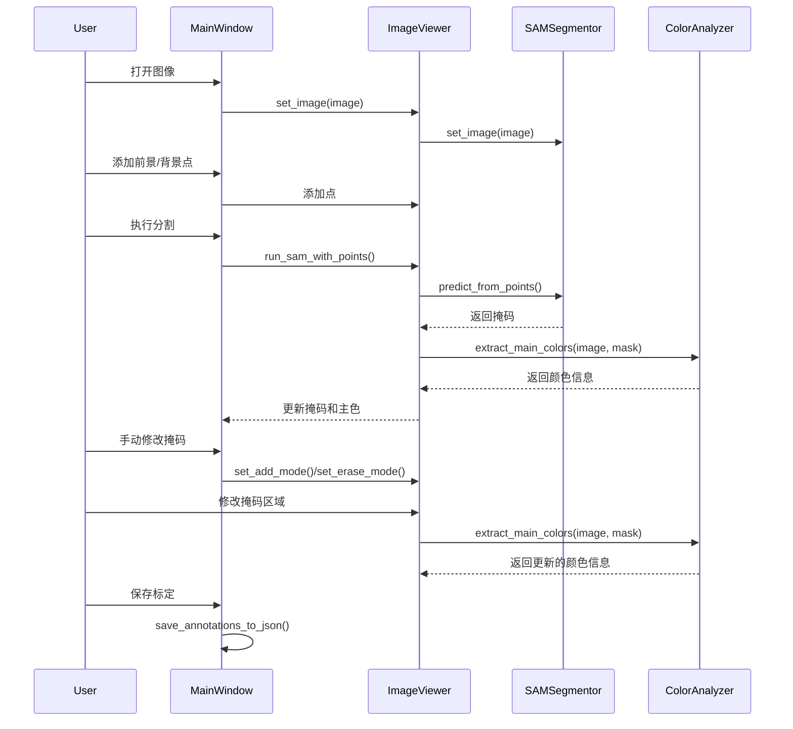
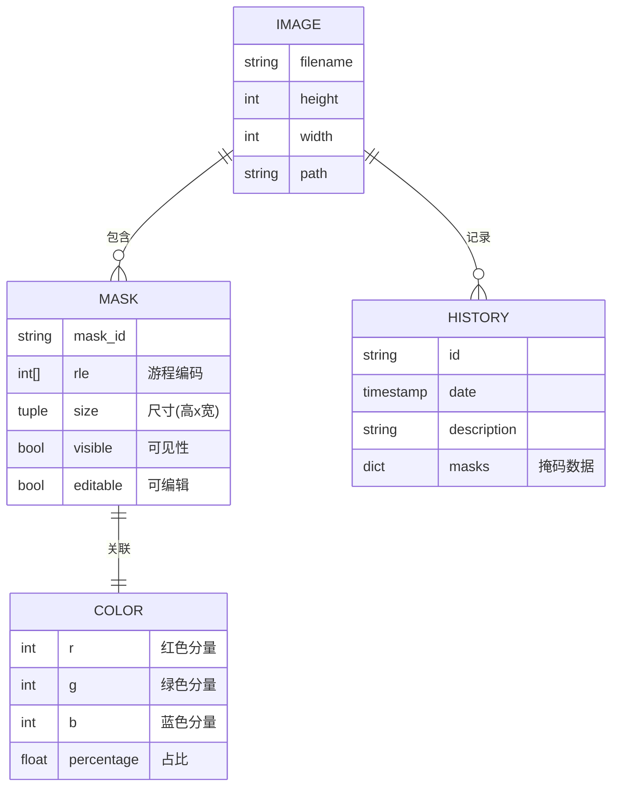

# 畲族服饰图像标定工具软件设计

## 1. 概述

### 1.1. 系统简介

畲族服饰图像标定工具是一个专门用于对畲族服饰图像进行标定、分析和管理的软件系统。本系统通过点击、分割与掩码绘制等方式进行区域主色提取与保存，支持智能分割、掩码编辑、历史记录管理等功能，方便用户进行精确的色彩分析。最终输出 RLE 压缩的 JSON 标注信息，便于后续的图像分析与主色统计工作，为畲族服饰数字化保护与研究提供专业工具支持。

系统主要解决以下问题：

1. 畲族服饰图像的精确区域标定
2. 服饰各部分主色提取与分析
3. 标定数据的保存、历史记录和管理
4. 为后续的畲族服饰色彩分析和研究提供基础数据

### 1.2. 目标读者

本文档面向以下读者：

- 开发团队成员
- 软件测试人员
- 系统维护人员
- 研究使用本系统的学者和研究人员
- 项目管理人员

### 1.3. 书写约定

- **粗体**：表示重要概念或关键功能
- _斜体_：表示需要特别注意的事项
- `代码块`：表示代码、变量名或文件名
- 缩写说明：
  - SAM：Segment Anything Model，用于图像分割的深度学习模型
  - RLE：Run-Length Encoding，运行长度编码，用于压缩掩码数据
  - GUI：Graphical User Interface，图形用户界面
  - CV：Computer Vision，计算机视觉

### 1.4. 参考文档

1. 《需求规格说明书》v1.0
2. 《PyQt5 官方文档》
3. 《OpenCV Python API 参考》
4. 《SAM 模型技术白皮书》

## 2. 总体设计

### 2.1. 系统架构

畲族服饰图像标定工具采用模块化分层架构设计，主要分为以下几个层次：



系统架构图文字描述：

- 顶层是 GUI 层，包括 PyQt5 用户界面组件
- 第二层是核心功能层，包括图像处理与分割等核心功能
- 第三层是工具库层，包括颜色分析等辅助工具
- 底层是数据层，处理标定数据与历史记录的持久化
- GUI 层主要包含 MainWindow、ImageViewer、AISegmentationWidget 和 HistoryDialog 等组件
- 核心功能层包含 SAMSegmentor、SAMWorker、ColorAnalyzer 和 HistoryManager 等组件

### 2.2. 架构设计依据

系统分层的依据是：

1. 按照软件工程的基本原则，将系统划分为界面、业务逻辑、模型和数据层
2. 考虑系统的主要功能需求，将各个功能模块进行合理组织
3. 保证各层之间的低耦合、高内聚，便于系统的维护和扩展
4. 符合 MVC（Model-View-Controller）设计模式的思想

### 2.3. 模块间依赖关系

模块间的依赖关系图如下：



模块依赖关系文字描述：

- 图像数据首先通过前/背景点标记进行初步处理
- 标记后的数据经过 SAM 分割生成掩码数据
- 掩码数据一方面进行颜色分析得到主色数据，另一方面可以通过手动修改进行优化
- 最终，掩码数据和主色数据被保存并输出为 JSON 格式

### 2.4. 用户界面层

**功能**：负责与用户的交互，包括图像显示、工具操作、标定结果展示等。

**使用的服务**：业务逻辑层提供的色彩分析、掩码处理和历史记录管理服务。

**提供的服务**：向用户提供图形化的操作界面，接收用户输入并显示处理结果。

主要包含以下模块：

- 主窗口模块：提供应用程序的主界面
- 图像查看器模块：负责图像的显示、缩放、拖动和标注操作
- AI 分割面板：提供 AI 辅助分割的操作界面
- 历史记录对话框：展示和管理历史标定记录

### 2.5. 业务逻辑层

**功能**：实现系统的核心业务逻辑，包括色彩分析、掩码处理和历史记录管理。

**使用的服务**：AI 模型层提供的图像分割服务和数据持久化层提供的存储服务。

**提供的服务**：向用户界面层提供数据处理和业务操作的服务。

主要包含以下模块：

- 色彩分析模块：负责从标定区域提取主色
- 掩码处理模块：处理用户绘制的掩码和 AI 生成的掩码
- 历史记录管理模块：管理标定历史快照

### 2.6. AI 模型层

**功能**：提供智能分割和色彩分析的算法支持。

**使用的服务**：底层深度学习框架提供的模型运行环境。

**提供的服务**：向业务逻辑层提供图像分割和色彩分析的算法服务。

主要包含以下模块：

- SAM 分割模型：基于点标注进行智能分割
- 色彩分割模型：基于色彩特征进行图像分割

### 2.7. 数据持久化层

**功能**：负责数据的永久存储和管理。

**使用的服务**：操作系统提供的文件系统服务。

**提供的服务**：向业务逻辑层提供数据的读写和管理服务。

主要包含以下模块：

- JSON 存储模块：将标定结果以 JSON 格式存储
- 快照管理模块：管理历史版本的快照文件

## 3. 详细设计

系统的总体类图如下，展示了主要类及其关系：



### 3.1. 主窗口模块详细设计

#### 3.1.1. 类定义

**主要类**：`MainWindow`

**继承关系**：继承自 `QMainWindow`

**类职责**：

- 作为应用程序的主窗口容器
- 组织各个功能模块的用户界面
- 协调各模块间的交互

#### 3.1.2. 接口定义

**主要方法**：

- `__init__()`: 初始化主窗口，创建各个 UI 组件

- `open_image(path)`: 打开指定路径的图像

  - 参数：`path` - 图像文件路径（字符串）
  - 返回：无
  - 异常：文件不存在或格式不支持时抛出异常

- `save_annotation()`: 保存当前标定

  - 参数：无
  - 返回：布尔值，表示保存是否成功
  - 异常：掩码为空或保存失败时抛出异常

- `save_annotations_to_json()`: 将标定结果保存为 JSON 文件

  - 参数：无
  - 返回：字符串，保存的文件路径
  - 异常：文件写入失败时抛出异常

- `add_annotation_to_table(color_info, mask_id)`: 向表格添加标注

  - 参数：
    - `color_info` - ColorInfo 对象，包含颜色信息
    - `mask_id` - 字符串，掩码的唯一标识符
  - 返回：整数，添加的行索引

- `delete_annotation(mask_id, row)`: 删除指定的标注

  - 参数：
    - `mask_id` - 字符串，掩码的唯一标识符
    - `row` - 整数，表格中的行索引
  - 返回：布尔值，表示删除是否成功

- `update_annotation_preview()`: 更新标注预览

  - 参数：无
  - 返回：无

- `update_color_pie_chart()`: 更新颜色饼图

  - 参数：无
  - 返回：无

- `show_history_dialog()`: 显示历史记录对话框
  - 参数：无
  - 返回：无

#### 3.1.3. 数据结构

- `has_unsaved_changes`: 布尔值，标记是否有未保存的修改
- `annotation_table`: 表格控件，用于显示标定列表
- `viewer`: 图像查看器实例
- `pending_mask_id`: 当前待处理的掩码 ID

### 3.2. 图像查看器模块详细设计

#### 3.2.1. 类定义

**主要类**：`ImageViewer`

**继承关系**：继承自 `QLabel`

**类职责**：

- 显示和管理图像
- 处理用户交互，如鼠标点击、拖拽等
- 支持图像的缩放和平移
- 管理掩码数据

#### 3.2.2. 接口定义

**主要方法**：

- `set_image(image)`: 设置显示的图像
- `set_add_mode()`: 设置为添加掩码模式
- `set_erase_mode()`: 设置为擦除掩码模式
- `reset_view()`: 重置视图到初始状态
- `undo()`: 撤销上一步操作
- `redo()`: 重做上一步操作
- `extract_main_color()`: 从掩码区域提取主色
- `run_sam_with_points()`: 使用点标注运行 SAM 分割

### 3.3. SAM 分割器模块详细设计

#### 3.3.1. 类定义

**主要类**：`SAMSegmentor`

**类职责**：

- 封装 SAM 模型的接口
- 提供基于点标注的图像分割功能

#### 3.3.2. 接口定义

**主要方法**：

- `set_image(image)`: 设置待分割的图像
- `predict_from_points(points, labels)`: 根据点标注预测分割掩码
- `segment_with_points(image, points, labels)`: 一站式分割函数

### 3.4. 颜色分析器模块详细设计

#### 3.4.1. 类定义

**主要类**：`ColorAnalyzer`

**类职责**：

- 分析图像或掩码区域的颜色信息
- 提取主色并计算占比

#### 3.4.2. 接口定义

**主要方法**：

- `analyze_image_colors(image, mask)`: 分析图像颜色
- `extract_main_colors(image, mask)`: 提取主色列表
- `merge_similar_colors(colors)`: 合并相似颜色

### 3.5. AI 分割面板模块详细设计

#### 3.5.1. 类定义

**主要类**：`AISegmentationWidget`

**继承关系**：继承自 `QWidget`

**类职责**：

- 提供 AI 辅助分割的用户界面
- 管理分割参数和操作

#### 3.5.2. 接口定义

**主要方法**：

- `performSegmentation()`: 执行分割操作
- `segment_image_with_colors()`: 基于颜色特征分割图像
- `run_ai_segmentation()`: 运行 AI 分割

### 3.6. 历史记录对话框模块详细设计

#### 3.6.1. 类定义

**主要类**：`HistoryDialog`

**继承关系**：继承自 `QDialog`

**类职责**：

- 显示标定历史记录
- 支持历史版本的预览和恢复

#### 3.6.2. 接口定义

**主要方法**：

- `load_history_list()`: 加载历史记录列表
- `restore_selected()`: 恢复选中的历史记录

### 3.7. 控制流程

#### 3.7.1. 主要操作流程图

下图展示了系统的主要操作流程，从打开图像开始，到保存标定结果结束：



#### 3.7.2. 序列图

下图展示了用户与系统交互的主要流程，说明了不同组件间消息传递的顺序：



## 4. 数据设计

系统的数据实体关系模型如下图所示：



### 4.1. JSON 格式数据定义

系统使用 JSON 格式存储标定数据，主要包括以下字段：

```json
{
  "masks": {
    "mask_0": {
      "color": [163, 57, 76],
      "visible": true,
      "editable": false,
      "size": [512, 512],
      "rle": [
        [32000, 12],
        [45678, 9]
      ]
    }
  }
}
```

- `masks`: 对象，包含多个掩码数据
  - `mask_id`: 掩码唯一标识符，作为键名
    - `color`: 数组，表示主色的 RGB 值 [R, G, B]
    - `visible`: 布尔值，表示掩码是否可见
    - `editable`: 布尔值，表示掩码是否可编辑
    - `size`: 数组，表示掩码尺寸 [height, width]
    - `rle`: 二维数组，表示 RLE 压缩的掩码数据

### 4.2. 历史记录数据结构

历史记录保存为独立的 JSON 文件，包含以下字段：

```json
{
  "id": "20240610123456",
  "timestamp": 1623278456,
  "date": "2024-06-10 12:34:56",
  "description": "标定快照",
  "masks": {
    // 与标定数据相同的掩码结构
  }
}
```

## 5. 系统部署

系统数据流图如下所示，展示了数据在系统中的流动路径：


### 5.1. 系统部署方案

系统可以以以下方式部署：

1. **独立桌面应用**：作为独立的 PyQt 应用程序，直接在 Windows、Linux 或 macOS 系统上运行。

2. **集成部署**：作为色彩研究平台的一个模块进行部署，与其他分析工具集成。

### 5.2. 运行环境要求

- **操作系统**：Windows 10/11、Ubuntu 20.04+、macOS 10.15+
- **Python**：3.10+
- **内存**：8GB 以上，推荐 16GB
- **GPU**：建议有 CUDA 支持的 NVIDIA 显卡，用于加速 AI 分割
- **磁盘空间**：至少 10GB 可用空间

### 5.3. 依赖项

主要的依赖库和版本要求：

- PyQt5 >= 5.15.0
- OpenCV >= 4.5.0
- NumPy >= 1.20.0
- PyTorch >= 1.9.0
- Segment-anything >= 1.0
- scikit-learn >= 1.0.0
- matplotlib >= 3.5.0

## 6. 其它事项

### 6.1. 性能考虑

系统在处理大尺寸图像时考虑了以下性能优化：

1. **自动图像缩放**：对于大尺寸图像自动缩放到合适大小进行处理
2. **SAM 模型异步处理**：使用线程池异步执行 SAM 分割，避免 UI 冻结
3. **放大镜优化**：使用节流技术限制放大镜更新频率，降低 CPU 负荷
4. **掩码压缩存储**：使用 RLE 压缩算法减少掩码存储空间需求

### 6.2. 安全性考虑

系统在数据安全方面采取的措施：

1. **自动保存历史**：定期自动保存历史快照，防止意外丢失
2. **未保存提醒**：关闭应用前检查未保存的修改并提醒用户
3. **数据验证**：在读写 JSON 数据时进行格式验证，防止数据损坏

### 6.3. 可扩展性

系统设计考虑了以下扩展点：

1. **算法插件系统**：可扩展的分割算法接口，便于集成新的 AI 模型
2. **自定义主色提取**：颜色分析算法可通过参数调整以适应不同需求
3. **批处理接口**：预留了批量处理图像的接口，便于未来扩展


