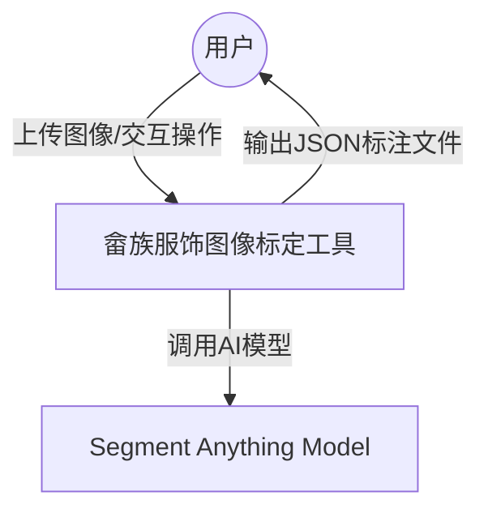
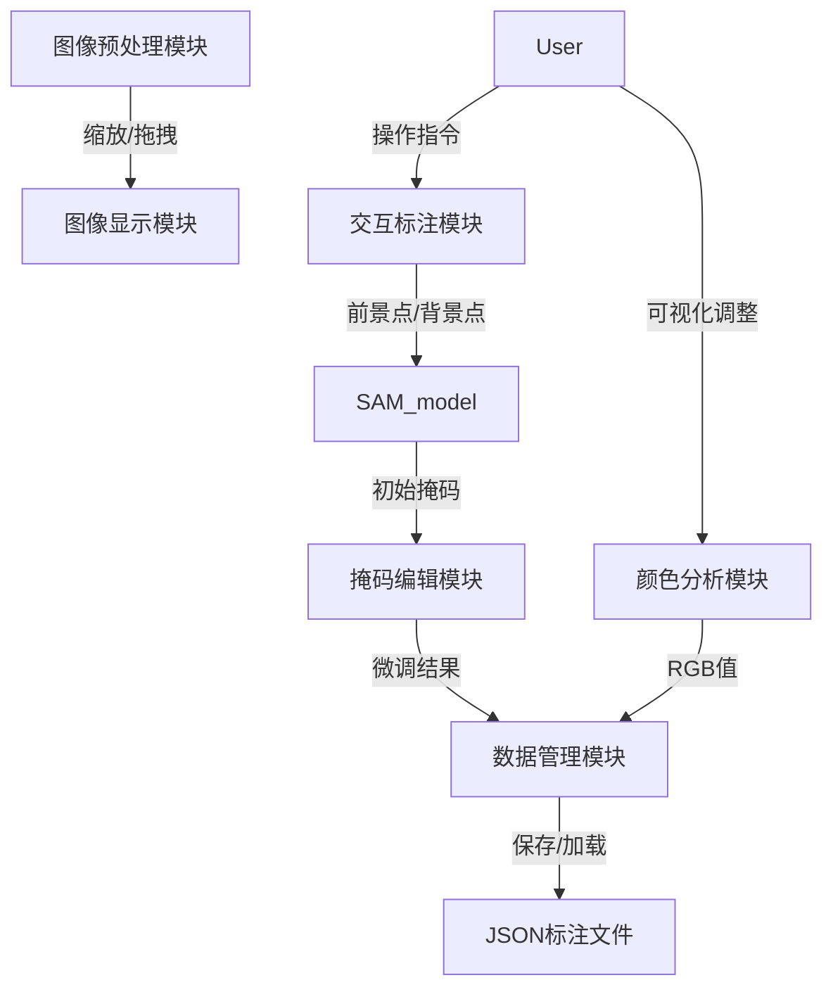
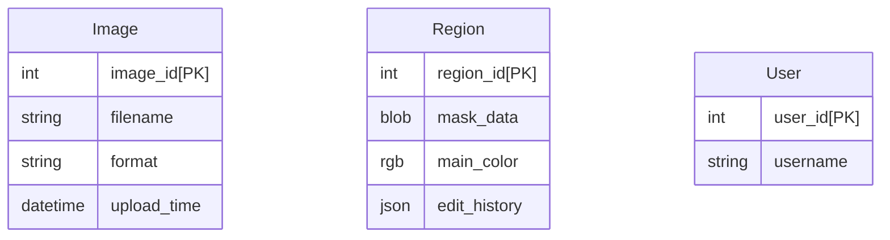

# 畲族服饰图像标定工具需求分析

## 1. 概述
### 1.1. 问题描述
随着数字民族学与文化遗产保护研究的深入，传统民族服饰图像数字化分析的需求日益增长。畲族服饰拥有复杂且富有特色的色彩搭配与纹样结构，其主色提取对实现数字化存档、模型学习与风格重建等工作具有重要意义。然而，现有图像分割工具无法满足精细化、多区域、可交互式主色标定的需求，特别是在主色混合、细节区域难以准确提取的情况下。因此，开发一套专门面向畲族服饰图像的主色标定工具具有重要的学术价值和应用前景。

### 1.2. 系统简介
本课题旨在设计并实现一款基于AI图像分割和手工标注相结合的图像处理工具，用于对畲族服饰图像进行主色区域的精确标定与颜色提取。主要内容包括：
1.	实现图像加载、缩放与拖拽等基本操作；
2.	集成基于SAM（Segment Anything Model）的智能分割模型，支持前景点/背景点标注；
3.	开发手动掩码添加、擦除、撤销、修改等交互功能；
4.	支持多区域标定与RGB主色可视化调整；
5.	保存为JSON格式的压缩标定数据，支持历史快照管理；
6.	为后续的主色提取与图像训练模型提供标定数据支持。

### 1.3. 目标读者
1.  民族文化研究者（主要用户）
2.  计算机视觉工程师（次要用户）
3. 非物质文化遗产保护机构（利益相关方）

## 2. 系统运行环境
### 2.1 硬件环境

    标注终端：Windows/macOS电脑
    编程语言：Python 3.8及以上
    图像处理库：OpenCV
### 2.2 软件交互

    输入：JPG/PNG/TIF/BMP等格式图像
    输出：JSON标注文件
## 3. 系统功能需求
1.  用户打开图像开始标定，支持手动拖拽、鼠标滚轮缩放图片
2. 双击左键添加前景点；Ctrl+单击左键添加背景点（前景点为绿色；背景点为红色）
3. 点击执行分割后AI自动分割出该主色块掩码
4. 人工对掩码进行微调，增加掩码、擦除掩码
5. 保存标定，可对该主色标定进行修改和删除

## 4. 系统非功能需求
1. 响应时间：单张图片打开响应时间小于3秒
2. 兼容性：系统应支持多平台运行，包括Windows、Linux和macOS操作系统。

## 5. 需求分析模型
### 5.1. 功能模型
顶层图

一层展开图

### 5.2. 数据模型

### 5.3. 数据字典
| **数据元素**           | **数据类型/格式**            | **说明**       |
|--------------------|------------------------|--------------|
| `image_id`         | `INT`                  | 图像唯一标识，自动生成的主键值 |
| `filename`         | `STRING`               | 原始图像文件名      |
| `format`           | `STRING`               | 图像格式         |
| `region_id`        | `INT`                  | 标注区域唯一标识，系统自动生成的主键值 |
| `mask_data`        | `BLOB`                 | 掩码二进制数据，存储像素级分割结果 |
| `main_color`       | `ARRAY[INT, INT, INT]` | 主色RGB值       |
| `edit_history`     | `JSON ARRAR`           | 编辑操作历史记录     |
| `foreground_point` | `ARRAY[INT, INT]`      | 前景点标注坐标      |
| `background_point` | `ARRAY[INT, INT]`      | 背景点标注坐标      |
| `json_output`      | `JSON OBJECT`          | 输出文件整体结构   |